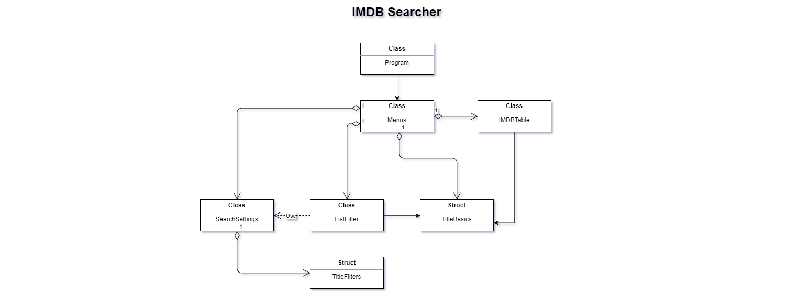

# **IMDB Searcher**

# Authorship
* __Leandro Brás__ > __a21801026__ 

* __Sara Gama__ > __a21705494__ 

## Contact

* [Leandro](https://github.com/xShadoWalkeR)
* [Sara]( https://github.com/serapinta )

## Git

[GitPage]( https://github.com/xShadoWalkeR/IMDB )

## Who did what

Note: Due to time limits we can say that the project was not able to be well divided.

__Leandro Brás__
-> Created all the necessary code for a working faze 1 of the project.
-> Commented all the code and created the doxygen documentation.

__Sara Gama__
-> Made report, UML and flowchart.

# Project architecture

## Our Solution

In the class `Program` we initialize the variable `myDisplay` of type `Menus`. And then we call the method `DrawMainMeu()` to give a start to the program and display the menu.

The `Menus` class is responsible for all of the drawings in the console. From it we can access 3 other classes to create a connection from the menu to them. On this class the user will be asked if he want's to have filters and/or a type of order, is so, some methods on the class `SearchSettings` will be called so the user can define all parameters. After this the method `FillList(string s)` will be called on the class `IMDBTable`, this will fill the list of titles.

Afterwards the method `FilterTitles(SearchSettings settings, IMDBTable titles)` is called in the class `ListFilter`, this will filter the previously acquired list with the parameters the user had chosen before. The method `DisplayFilteredList()` is then call to display all the items in the currently filtered list. The user is then able to select one of the displayed titles, selecting a title will display the full information about it.

The class `IMDBTable : List<object>` is it self a list. It's has an empty constructor, when the method `FillList(string s)` is called the file containing all the titles will be read calling the method `SaveFileData(string s)` at each line read, this method will then check if the title on the current line contains a string equal to the search input of the user, and if so it will create a new struct will all the necessary values to the the title information, adding it to the list (the class it self).

The class `ListFilter` Will filter and order the list of titles based on previously set parameters by the user. This class makes use of the `SearchSettings` class to be able to read the the selected parameters and filter the list.

## UML

## Conclusions

__Leandro Brás__
With this project I learn that with not much time it's really hard to complete a project. I also got a better understanding of structs, Enums and LinQ, increasing my overall C# knowledge.

__Sara Gama__
Reading all the code and making  this report helped me understand the logic or programming a bit better.

## References
* [LP1_Aulas](https://github.com/VideojogosLusofona/lp1_2019_aulas): 
Power-points provided by the teacher

## Thanks
We are grateful to João Duarte and Flávio Santos who help us in blu blu.

